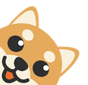

## Table of Contents

- [Sets](#Sets)
  - [Blob](#blob)
  - [Blob-Sign](#blob-sign)
  - [Froge](#froge)
  - [Froggie](#froggie)
  - [He Brings You](#he-brings-you)
  - [Gopha](#gopha)
  - [Llama](#llama)
  - [Meow](#meow)
  - [Parrots](#parrots)
  - [Party](#party)
  - [Pokemon](#pokemon)
  - [Scrabble](#scrabble)
  - [Shiblob](#shiblob)
- [Uploading Emoji to Slack](#Uploading-Emoji-to-Slack)
- [Contributing New Emoji/Emoji Sets](#Contributing-New-Emoji/Emoji-Sets)
- [Common Errors](#Common-Errors)
- [Getting Help](#Getting-Help)
- [Credits](#Credits)

## Sets

See below for previews from each individual set:

### [Blob](emoji/blob/README.md)

### [Blob-Sign](emoji/blob-sign/README.md)

### [Froge](emoji/froge/README.md)

### [Froggie](emoji/froggie/README.md)

### [He Brings You](emoji/he-brings-you/README.md)

### [Gopha](emoji/gopha/README.md)

### [Llama](emoji/llamas/README.md)

### [Meow](emoji/meow/README.md)

### [Parrots](emoji/parrots/README.md)

### [Party](emoji/party/README.md)

### [Pokemon](emoji/pokemon/README.md)

### [Scrabble](emoji/scrabble/README.md)

### [Shiblob](emoji/shiblob/README.md)

## Uploading Emoji to Slack

1.  Clone or [download this
    repository](https://github.com/SeanPrashad/slackmojis/archive/master.zip) to
    your local machine. If you have downloaded the `.zip` file, unzip it using a
    third-party or built-in tool made for extracting archives.
1.  Follow one of the options below to begin uploading emoji:

      

      
Option 1: Chrome extension

    1.  Open Chrome and browse to:

            chrome://extensions

    1.  Click on the `Load unpacked` button and select the `extension` folder from
        within this repository
    1.  Navigate to `$slackWorkspaceURL/customize/emoji`, where
        `$slackWorkspaceURL` is the URL of the Slack workspace

        **Note**: 20 emoji will be uploaded per minute - be patient!

        **Note**: This extension has been adapted from the [Neutral Face Emoji
        Tool](https://github.com/Fauntleroy/neutral-face-emoji-tools) and now lives
        [here](https://github.com/SeanPrashad/respectful-emoji-tool#respectful-emoji-tool)!

      

      

      
Option 2: CLI

    1.  Install [slack-emoji-upload](https://github.com/sgreben/slack-emoji-upload)
    1.  Get an `xoxs-*` Slack token following
        [these instructions](https://github.com/jackellenberger/emojme#finding-a-slack-token).
        (_The team/email/password approach doesn't work, but token should_)
    1.  Stick the token in a variable, to keep it out of your shell history:

            read -s TOKEN $GENERATED_SLACK_TOKEN

    1.  Change to the directory you want to import emoji from
    1.  Run the following command, ensuring to substitute the name of your Slack
        workspace. The `xargs` prevents an open-files bug with an upload speed of
        one emoji every 4 seconds, or 15 per minute (_20 max as per Slack rate limits_):

            ls -1 | xargs -n 20 slack-emoji-upload -team $YOUR_SLACK_TEAM -token $GENERATED_SLACK_TOKEN -rate-limit 4s

      

## Contributing New Emoji/Emoji Sets

Contributions are always welcome! In your pull request, please make sure to do
the following:

1. Create a new folder with a name that reflects the theme of the emoji you are
   adding, or use an existing one if applicable
1. Ensure each emoji is under 100 KB in size and of a `.png`, `.jpg`, or `.gif`
   extension
1. Ensure that each emoji is prefixed with the theme plus a hyphen, ie.
   `gopha-xxx` - this will allow users in Slack to easily search for `gopha-` and
   view all emoji for that set
1. Run `node generate-readme.js` to generate/update README's for all of the newly
   added emoji!

## Getting Help

If you ever have questions or need assistance, please [open a GitHub issue](https://github.com/SeanPrashad/slackmoji/issues/new) best
describing the problem!

## Common Errors

- Gifs over 100 KB will result in an upload error - use
  [Ezgif.com](https://ezgif.com/optimize) to resize images under 100 KB
- Emoji which conflict with reserved emoji names will
  result in a `error_bad_name_i18n` error

## Credits

All emoji were sourced from the following repositories/websites:

- Blob folder: https://blobs.gg
- Gopha folder: https://github.com/tenntenn/gopher-stickers
- Llama folder: https://www.weibo.com/huiro, https://www.deviantart.com/jerikuto
- Meow folder: https://blobs.gg
- Parrots folder: https://github.com/jmhobbs/cultofthepartyparrot.com
- Party folder: https://github.com/aendrew/party-everything
- Pokemon folder: https://blobs.gg
- Scrabble folder: https://slackmojis.com
- Shiblob folder: https://blobs.gg
