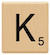
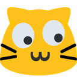

  
  
  

## Collections

See below for previews from all categories!

### [Blob](emojis/blob/README.md)


### [Blob-Sign](emojis/blob-sign/README.md)


### [Gopha](emojis/gopha/README.md)


### [Llama](emojis/llamas/README.md)


### [Meow](emojis/meow/README.md)



### [Parrots](emojis/parrots/README.md)


### [Party](emojis/party/README.md)


### [Pokemon](emojis/pokemon/README.md)


### [Scrabble](emojis/scrabble/README.md)


### [Shiblob](emojis/scrabble/README.md)


### [Slackmojis.com](emojis/slackmoji.com/README.md)


## Adding Emoji to Slack

1. Clone or [download this
   repository](https://github.com/SeanPrashad/slackmojis/archive/master.zip) to
   your local machine. If you have downloaded the `.zip` file, unzip it using a
   third-party or built-in tool made for extracting archives.
1. Follow one of the options below to begin uploading emoji:

<details>

<summary>Option 1: Respectful Emoji Tool extension</summary>

1. Open Chrome and browse to `chrome://extensions`
1. Click on the `Load unpacked` button and select the `extension` folder from
   within this repo
1. Navigate to `mySlackWorkspaceURL/customize/emoji`, where `mySlackWorkspaceURL` is the URL of your Slack workspace to begin uploading emoji

**Note**: 20 emoji will be uploaded per minute - be patient!

**Note**: This extension has been adapted from the [Neutral Face Emoji Tool](https://github.com/Fauntleroy/neutral-face-emoji-tools) and now lives
[here](https://github.com/SeanPrashad/respectful-emoji-tool#respectful-emoji-tool)!

</details>

<details>
<summary>Option 2: CLI</summary>

1.  Install [slack-emoji-upload](https://github.com/sgreben/slack-emoji-upload)
1.  Get an `xoxs-*` Slack token following
    [these instructions](https://github.com/jackellenberger/emojme#finding-a-slack-token).
    (The team/email/password approach has never worked for me, but token works great.)
1.  Stick the token in a variable, to keep it out of your shell history:

    ```
    $ read -s TOKEN
    [paste token and hit enter]
    ```

1.  Change to the directory you want to import emoji from
1.  Import them like so, substituting the name of your slack workspace. The `xargs` works
    around an open-files bug I encountered, and the rate-limit (one every 4s or 15/minute)
    is just under Slack's reported 20-request-per-minute limit.

    ```
    $ ls -1 | xargs -n 20 slack-emoji-upload -team YOUR_SLACK_TEAM -token $TOKEN -rate-limit 4s
    ```

</details>

## Contributing New Emoji

Contributions are always welcome! In your pull request, please make sure to do
the following:

1. Create a new folder with a name that reflects the theme of the emoji you are
   adding
1. Ensure each emoji is under 100 kb in size and of a `.png`, `.jpg`, or `.gif`
   format
1. Ensure that each emoji is prefixed with the theme plus a hyphen, ie.
   `gopha-xxx`; this will allow users in Slack to easily search for `gopha-` and
   view all emoji for that category
1. Run `node generate-readme.js` to generate a `README.md` containing all of the
   emojis in your new folder!

## Common Errors

- Gifs over 100 KB will result in an upload error - use
  [Ezgif.com](https://ezgif.com/optimize) to resize images under 100 KB
- Emoji which conflict with standard emoji names in other languages will
  result in a `error_bad_name_i18n` error

## Credits

All emoji were sourced from the following repositories/websites:

- Blob folder: https://blobs.gg
- Gopha folder: https://github.com/tenntenn/gopher-stickers
- Llama folder: https://www.weibo.com/huiro, https://www.deviantart.com/jerikuto
- Meow folder: https://blobs.gg
- Parrots folder: https://github.com/jmhobbs/cultofthepartyparrot.com
- Party folder: https://github.com/aendrew/party-everything
- Pokemon folder: https://github.com/SeanPrashad/slackmojis/tree/master/pokemon
- Scrabble folder: https://slackmojis.com
- Shiblob folder: https://blobs.gg
- Slackmoji.com folder: https://slackmojis.com
